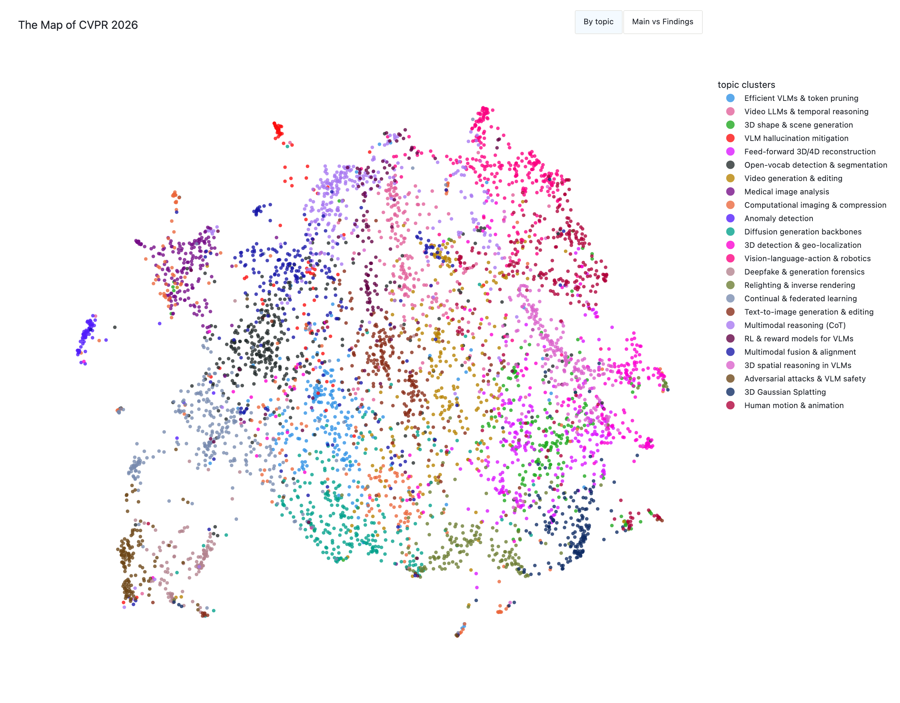
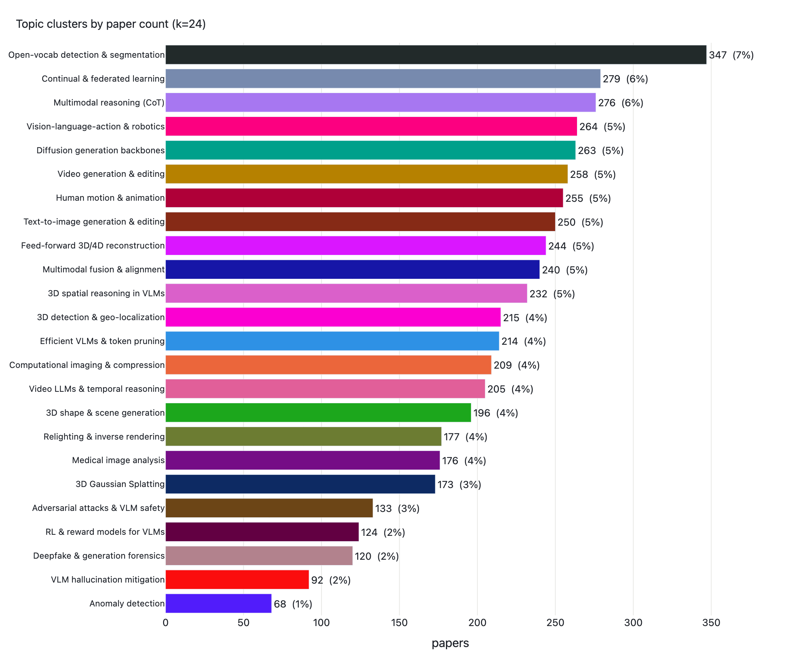
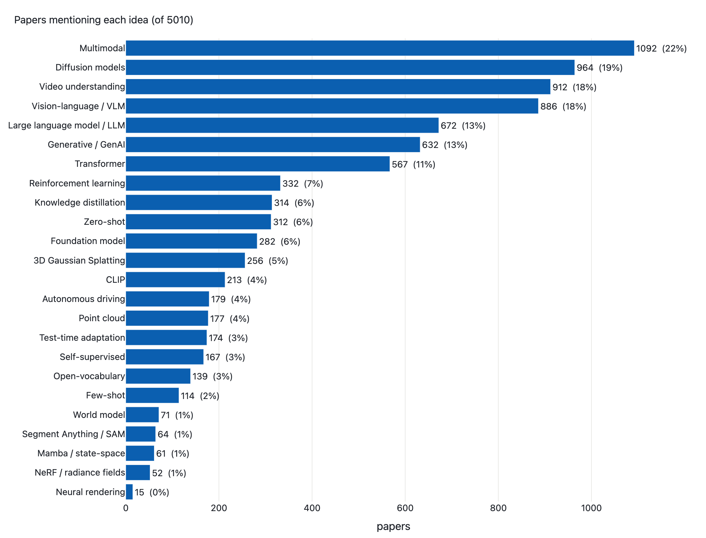
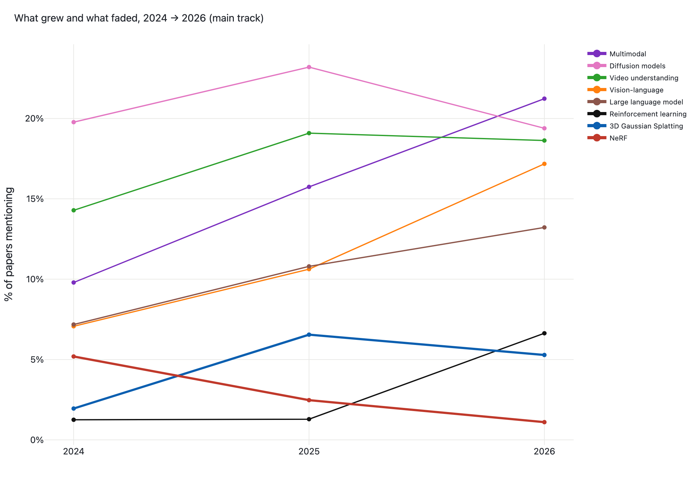
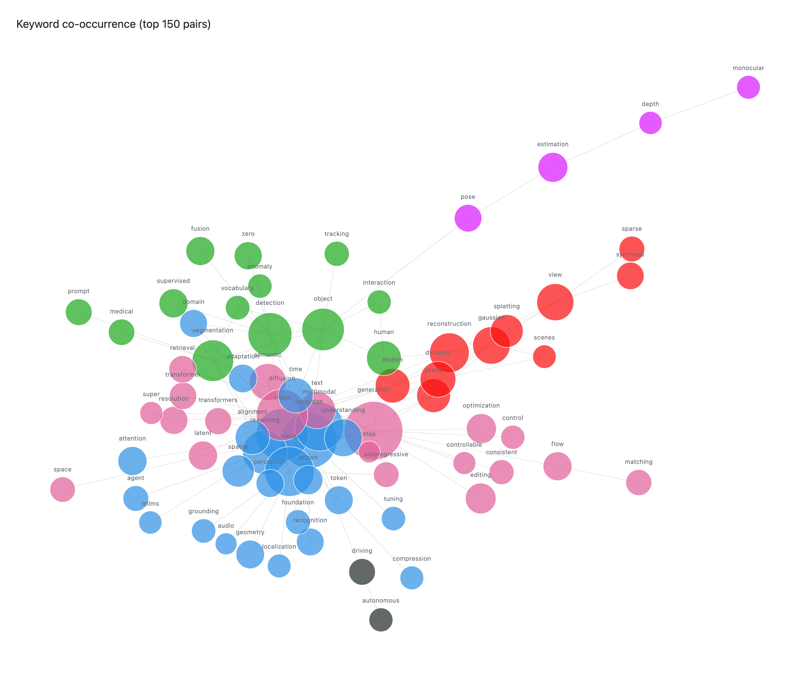
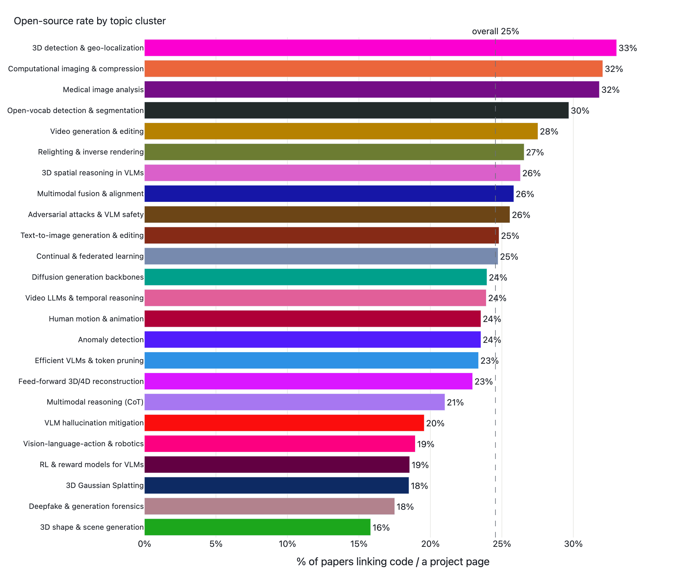
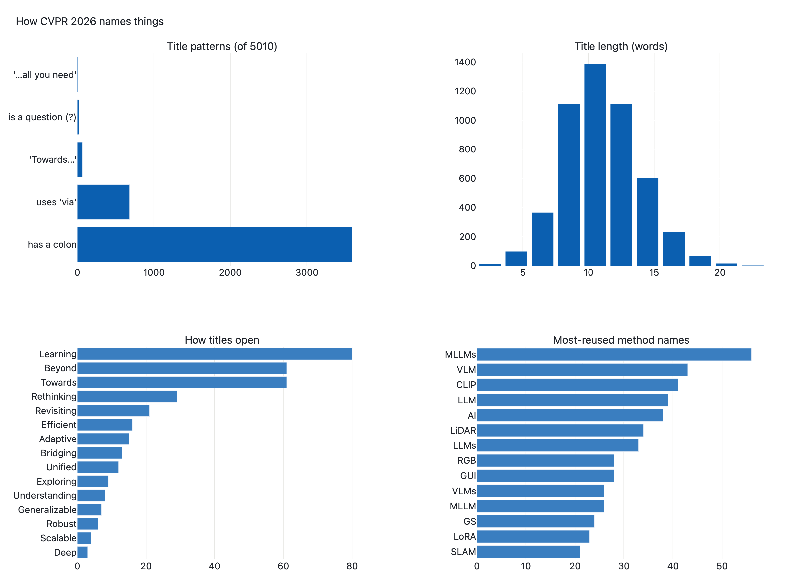

<!--
══════════════════════════════════════════════════════════════════════
HOW TO PUBLISH THIS ON MEDIUM  (delete this whole comment before posting)
══════════════════════════════════════════════════════════════════════

Easiest path (≈3 min):
  1. Go to medium.com → your avatar → "Stories" → "Import a story".
  2. Paste the live post URL:
       https://genawass.github.io/posts/cvpr2026.html
     Medium imports the title + text but DROPS the interactive charts.
  3. At each chart spot, drag in the matching PNG from ./images/ and paste the
     "Interactive version →" link below it as a caption.

Alternative (full control): create a new story and copy each section below by
hand, uploading the PNG where the image line appears. Medium does not render
local image paths or interactive iframes — the PNGs must be uploaded, and the
interactive charts stay as links back to the blog.

Images live in:  ./images/01_map.png … 07_code.png  (7 charts)
Canonical interactive version:  https://genawass.github.io/posts/cvpr2026.html
══════════════════════════════════════════════════════════════════════
-->

# The Map of CVPR 2026

### One dot per paper: a data-driven tour of all 5,010 accepted papers — the topics that dominate, the new Findings track, how the field changed since 2024, who ships code, and how it names its work.

CVPR 2026 accepted 5,010 papers — 4,069 in the main conference and 941 more in the new Findings track. That is far more than any one person can read — but it is small enough to *see* all at once. I embedded every paper from its title and abstract, projected the whole corpus down to two dimensions, and let the topics arrange themselves.

> 👉 **Everything below is interactive on the original post** — hover any dot for its title, zoom into neighborhoods, toggle clusters: **https://genawass.github.io/posts/cvpr2026.html**

## One dot per paper

Each point is one accepted paper, placed so that papers about similar things sit near each other; colors are 24 topic clusters the data fell into on its own. On the interactive version you can also recolor the map by track — main conference vs. the new Findings papers.

*The Map of CVPR 2026 — all 5,010 papers, embedded with a sentence-transformer and projected to 2D with UMAP. Color = automatically discovered topic cluster. ▶ Interactive version: https://genawass.github.io/posts/cvpr2026/charts/01_map.html*

The first thing the map makes obvious is how **generative and language-shaped** the field has become. The big continents are diffusion-based image and video generation, vision-language models, and 3D reconstruction — and they are no longer separate islands. They bleed into each other, because the same backbones (diffusion transformers, CLIP-style encoders, large multimodal models) now show up everywhere.

## The new Findings track

CVPR 2026 introduced a **Findings** track — 941 papers (19% of the total) accepted as solid contributions a notch below the main program. Flip the map to *Main vs Findings* and the two overlap almost everywhere: Findings is mostly a *mirror* of the main conference, not a different field. But it isn't uniform. Findings is over-represented in the applied, incremental corners — deepfake forensics (31% of that cluster), computational imaging and compression (26%), medical imaging (25%), and VLM efficiency (25%) — and under-represented in the buzzy frontier it leaves to the main track: 3D reconstruction and generation, video generation, and 3D spatial reasoning (each ~12–15%).

## What the conference is about

Collapsing the map into cluster sizes gives the topic landscape, and this year it is strikingly flat — no single topic runs away with the conference. The largest clusters each hold 250–350 papers (5–7%): **open-vocabulary detection and segmentation**, multimodal reasoning, vision-language-action and autonomous driving, diffusion-based generation and super-resolution, video generation, human motion, and image editing. Behind them sits a long tail of 3D reconstruction, continual / federated learning, and pose / depth estimation.

*The 24 clusters, sized by paper count and labeled by hand from each cluster's representative titles. ▶ Interactive version: https://genawass.github.io/posts/cvpr2026/charts/02_topics.html*

## The ideas everyone is building on

How many papers even *mention* a given idea, anywhere in their title or abstract? This is the closest thing to a popularity contest for techniques.

*Share of the 5,010 papers mentioning each idea (document frequency over title + abstract). A paper can count toward several. ▶ Interactive version: https://genawass.github.io/posts/cvpr2026/charts/03_buzzwords.html*

A few things jump out:

- **Multimodal (22%), diffusion (19%), and video (18%)** are now the water everyone swims in. Add vision-language models (18%) and LLMs (13%) and the generative-multimodal core is unmistakable.
- **Gaussian Splatting has lapped NeRF.** 3DGS appears in 5.1% of papers; NeRF and radiance fields in just 1.0% — a ratio that was reversed only two years ago (see the trend below).
- **Mamba / state-space models stayed niche** at 1.2% — having only just edged past NeRF. The transformer (11% explicit, far more implicit) is still the default, despite the hype cycle around its successors.

## What grew and what faded

With the 2024 and 2025 proceedings scraped too, the snapshot becomes a trajectory. The three-year story is the **generative-multimodal takeover**: multimodal papers more than doubled (10% → 21% of the main track), vision-language models did the same (7% → 17%), and explicit LLM mentions climbed from 7% to 13%. The sharpest newcomer is **reinforcement learning** — flat near 1% through 2025, then exploding to 6.6% in 2026 as RL-style post-training swept into vision.

*Document frequency of each idea across the CVPR 2024, 2025 and 2026 main tracks (Findings excluded for a like-for-like comparison). ▶ Interactive version: https://genawass.github.io/posts/cvpr2026/charts/06_trends.html*

The chart also settles the NeRF question. In 2024, NeRF / radiance fields (5.2%) led 3D Gaussian Splatting (2.0%); by 2025 splatting had lapped it (6.5% vs 2.5%), and in 2026 NeRF has all but vanished (1.1%) while splatting holds near its peak. A few ideas cooled too — point clouds, CLIP, and zero-/few-shot framings all drifted down as the field's center of mass moved to generation and reasoning.

## How topics connect

The concept words in paper titles co-occur in telling ways. Drawing the strongest 150 co-occurring term pairs as a network shows the field's wiring: a dense **vision-language-reasoning hub** (language, vision, visual, multimodal, reasoning) sits at the center, wired to a generation-and-diffusion cluster (generation, diffusion, editing, latent, flow). Tighter satellite communities orbit it — detection / segmentation, 3D reconstruction (gaussian, splatting, view, scene), pose / depth estimation, and a small autonomous-driving knot.

*Top 150 co-occurring title terms (connected groups only). Node size = how many papers use the term; color = community; layout = force-directed. ▶ Interactive version: https://genawass.github.io/posts/cvpr2026/charts/04_network.html*

## Who ships their code

Roughly **a quarter of papers (25%)** link a public repo or project page in their abstract — but the rate swings widely by topic. The most reproducible corners are the classic perception tasks: 3D detection and geo-localization (33%), computational imaging and compression (32%), medical imaging (32%), and open-vocabulary detection (30%). The most closed are the frontier generative areas — 3D shape and scene generation (16%), Gaussian Splatting (18%), and the RL / VLA / agent clusters (~19%) — where the work is newer, heavier, and often closer to a product.

*Share of each cluster's papers that link code or a project page in the abstract. Dashed line = the 25% conference-wide average. ▶ Interactive version: https://genawass.github.io/posts/cvpr2026/charts/07_code.html*

## How the field names its work

A lighter look — the linguistics of the titles themselves. Just under three out of four titles (72%) now use the `Name: Description` colon format. The dramatic *"X is All You Need"* meme has almost died out (just 6 titles), and question-titles stay rare (23). Papers like to open with *Learning*, *Towards*, *Beyond*, and *Rethinking* — and the most-reused acronyms (MLLM, VLM, CLIP, LLM, LiDAR, GUI) are themselves a snapshot of the year's obsessions.

*Title patterns, length distribution, opening words, and the most-reused method names across all 5,010 titles. ▶ Interactive version: https://genawass.github.io/posts/cvpr2026/charts/05_naming.html*

## And the people

Behind the 5,010 papers are **20,671 distinct authors**. The typical paper now carries six authors (mean 6.3); the largest single author list runs to forty. Computer vision has become, decisively, a team sport.

---

**Method & caveats.** This is a snapshot of the *accepted* papers — 4,069 main-conference plus 941 Findings — scraped from CVF Open Access. Embeddings come from the `all-MiniLM-L6-v2` sentence-transformer, so proximity on the map means semantic similarity of text — not citations or impact. Clusters and the 2D layout are unsupervised; the 24 cluster labels were written by hand from each cluster's representative titles. Idea counts are regex matches over each paper's title and abstract; the concept network is built from title-word co-occurrence; the open-source rate is a heuristic (does the abstract link a repo or project page?) and undercounts code released only after publication. Year-over-year trends compare the CVPR 2024–2026 main tracks for consistency.

*Interactive version and code: https://genawass.github.io/posts/cvpr2026.html · https://github.com/genawass*
